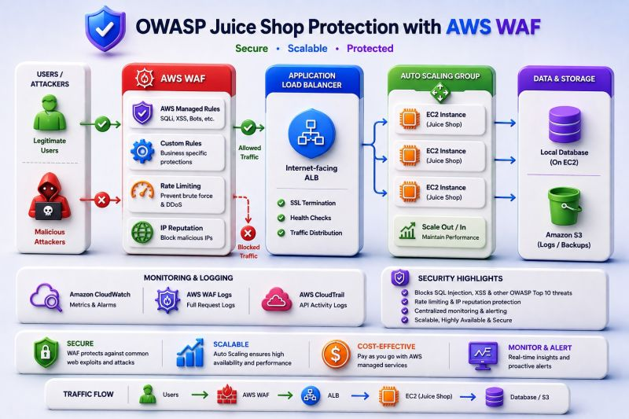
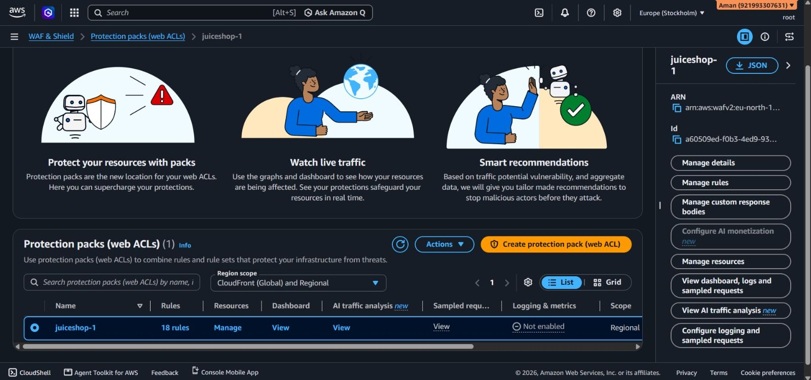
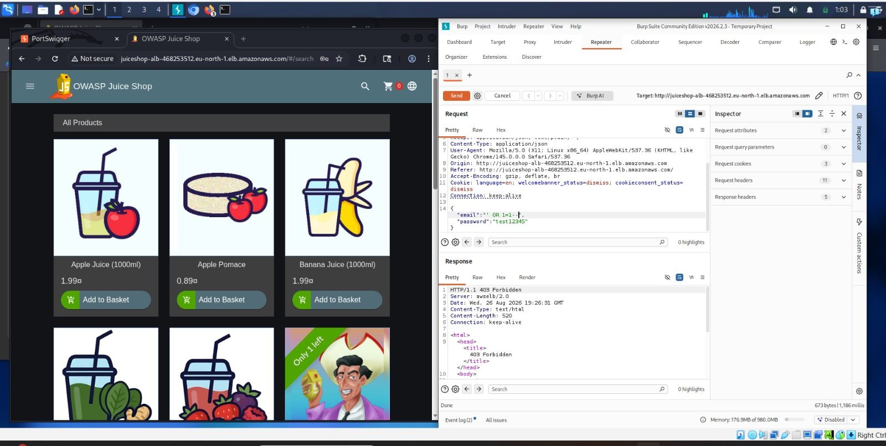
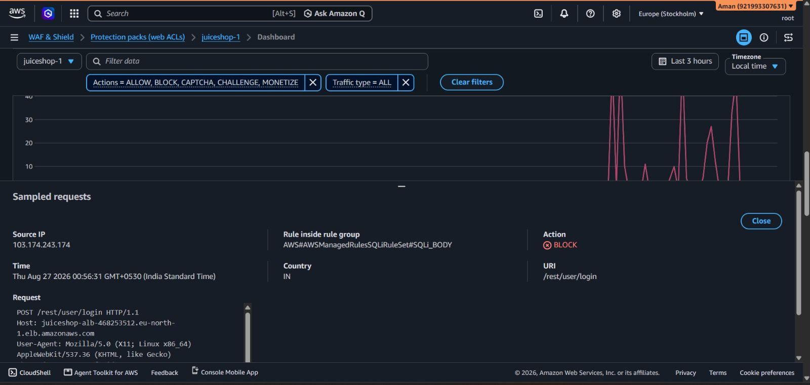
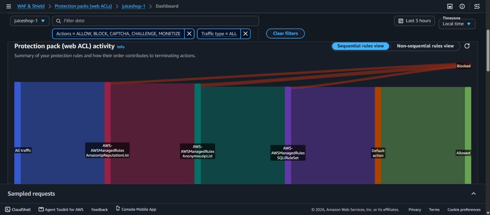

 🛡️ Protecting OWASP Juice Shop from Suspicious SQL Injection Requests Using AWS WAF

 🚨 Can a Web Application Detect a SQL Injection Attack Before It Reaches the Backend?

This project demonstrates how AWS WAF can be used as an additional security layer to inspect and block suspicious HTTP requests before they reach a web application.

For this project, OWASP Juice Shop was deployed in a controlled AWS environment and protected using AWS WAF, an Application Load Balancer, and AWS Managed Rule Groups.

The objective was to understand how incoming HTTP requests travel through cloud infrastructure and how AWS WAF evaluates and blocks suspicious request patterns.

 🏗️ Architecture

 
 

                👤 User / Tester
                       │
                       ▼
                 🛡️ AWS WAF
                       │
                       ▼
          ⚖️ Application Load Balancer
                       │
                       ▼
              🍹 OWASP Juice Shop

AWS WAF acts as an additional security layer in front of the application by inspecting incoming HTTP requests before allowed traffic reaches the backend.

 🔄 Request Flow

During security testing, traffic followed this path:

Browser
   │
   ▼
Burp Suite
   │
   ▼
AWS WAF
   │
   ▼
Application Load Balancer
   │
   ▼
OWASP Juice Shop

This architecture made it possible to capture and analyze HTTP traffic before validating how AWS WAF handled suspicious requests.

 🔍 Project Objectives

The main objectives of this project were:

* Deploy OWASP Juice Shop in a controlled AWS environment
* Configure an Application Load Balancer
* Create an AWS WAF Web ACL
* Attach AWS WAF protection to the Application Load Balancer
* Configure AWS Managed Rule Groups
* Inspect HTTP traffic using Burp Suite Community Edition
* Analyze HTTP requests, headers, request bodies, and APIs
* Perform controlled security testing in an authorized lab environment
* Validate AWS WAF decisions using Sampled Requests

---

 🛠️ Technologies Used

* ☁️ AWS WAF
* ⚖️ Application Load Balancer
* 🍹 OWASP Juice Shop
* 🕵️ Burp Suite Community Edition
* 🛡️ AWS Managed Rule Groups
* 📊 AWS WAF Sampled Requests

---

 🛡️ AWS WAF Protection
 

An AWS WAF Web ACL was configured and associated with the Application Load Balancer.

AWS Managed Rule Groups were used to provide protection against common web application threats.

AWS WAF inspects incoming HTTP requests and evaluates them against configured rules.

The request flow can be represented as:

Incoming Request
       │
       ▼
AWS WAF Inspection
       │
       ├── No suspicious pattern detected
       │         │
       │         ▼
       │       ALLOW
       │         │
       │         ▼
       │        ALB
       │         │
       │         ▼
       │    Application
       │
       └── Suspicious pattern detected
                 │
                 ▼
                BLOCK
                 │
                 ▼
             HTTP 403

 🧪 Security Testing

 

Burp Suite Community Edition was used to capture and inspect HTTP requests generated by the application.

The testing was performed only in an authorized and controlled lab environment.

Two types of traffic were compared.

 ✅ Normal Application Traffic

Request
   │
   ▼
AWS WAF
   │
   ▼
ALLOW
   │
   ▼
Application Load Balancer
   │
   ▼
OWASP Juice Shop

Normal application requests were allowed to continue to the backend application.

 🚨 Controlled Suspicious SQL Injection-Like Patterns

 

Suspicious request patterns were sent through the same infrastructure.

Request
   │
   ▼
AWS WAF
   │
   ▼
SQL Injection Rule Match
   │
   ▼
BLOCK
   │
   ▼
HTTP 403

The suspicious request was blocked by AWS WAF before reaching the backend application.

 📊 Validation Using AWS WAF

AWS WAF Sampled Requests were used to validate the WAF decisions.

The following information was analyzed:

* 📍 Source IP
* 🔗 Request URI
* ⏰ Timestamp
* 🛡️ Matching rule
* 🚫 Action performed

This helped confirm which requests matched the configured protection rules and whether AWS WAF allowed or blocked the request.

 🛡️ Defense in Depth

 

Traditional application security can rely heavily on application-level validation.

Application
   │
Detect Attack
   │
Respond

With an additional WAF security layer:

Incoming Request
       │
       ▼
AWS WAF
       │
Threat Detection
       │
       ▼
BLOCK
       │
       ▼
Backend Application Protected

This demonstrates the principle of defense in depth, where multiple security layers help reduce the likelihood of malicious traffic reaching backend resources.

 🏆 Project Outcome

The project demonstrated an end-to-end web application security workflow:

Deploy Application
        │
        ▼
Configure ALB
        │
        ▼
Attach AWS WAF
        │
        ▼
Enable Managed Rules
        │
        ▼
Inspect HTTP Traffic
        │
        ▼
Perform Controlled Testing
        │
        ▼
Detect Suspicious Patterns
        │
        ▼
BLOCK Request
        │
        ▼
Validate Results

The final testing confirmed that AWS WAF successfully blocked controlled suspicious SQL injection-like request patterns while allowing normal application traffic.

 ⚠️ Disclaimer

This project was performed in a controlled and authorized lab environment using OWASP Juice Shop.

The purpose of this project was educational: to understand web application security, HTTP request inspection, AWS WAF rule evaluation, and defense-in-depth architecture.

No unauthorized systems were tested.

 👨‍💻 Key Learning

This project helped me understand that web application security is not limited to the application code itself.

Security can be implemented at multiple layers of the infrastructure:

User
 ↓
Web Application Firewall
 ↓
Load Balancer
 ↓
Application

By inspecting and filtering suspicious traffic before it reaches the backend, AWS WAF provides an additional layer of protection for web applications.
